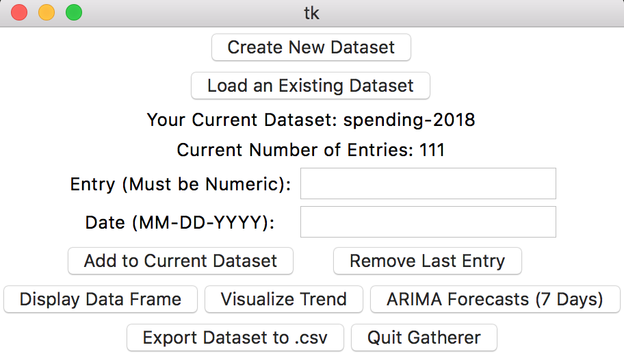
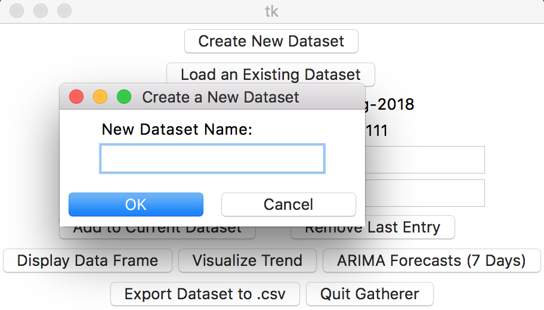
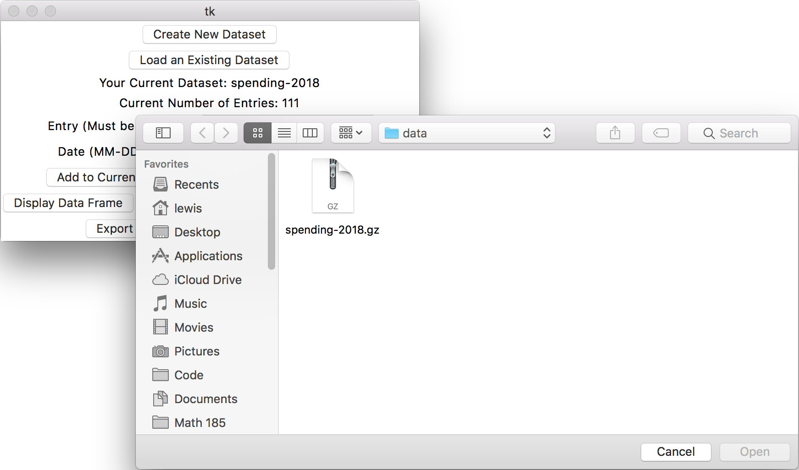
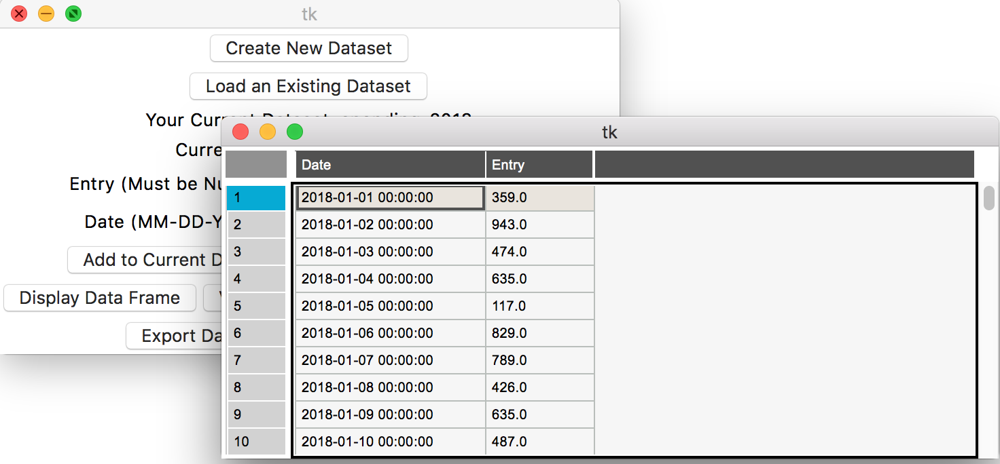
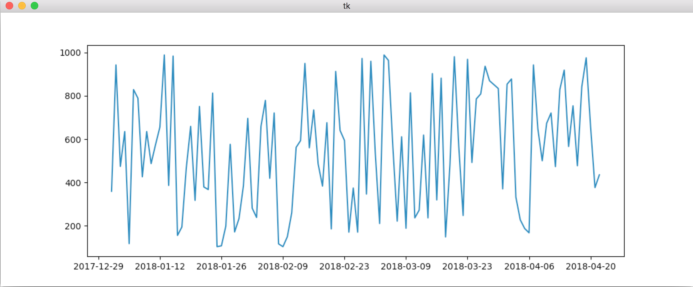
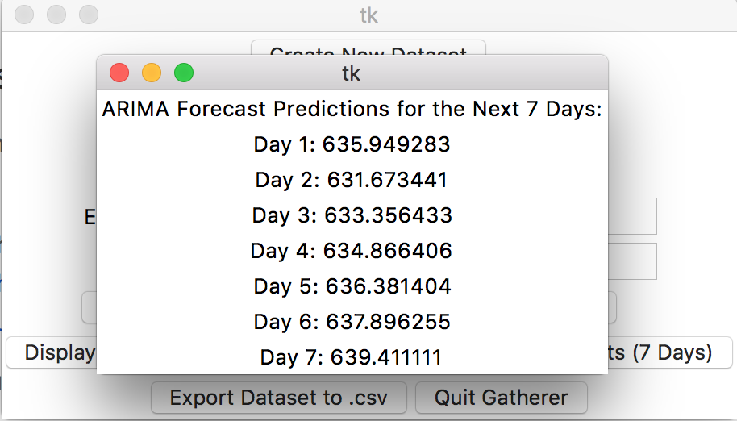

# Gatherer: GUI Walkthrough

This page will give you a brief overview of how Gatherer works, and examples of its GUI.

**Main Page of Gatherer.**

The main interface that displays the name of your current dataset, the current number entries, and an option to visualize and predict the data.

 

**Creating a new dataset.**

A string dialog box that creates a .gz file in the data folder with the name that the user selects.

 

**Loading an existing dataset.**

A file-open box that asks the user to select their dataset (must be .gz file). Currently, this box can open any kind of file, and it needs to be restricted to .gz files.

 

**Diplaying the time series data.**

A ``pandastable`` window that displays the time series data (with 2 columns: Entry and Date) that the user is currently working with.

 

**Simple trend visualization using ** ``matplotlib``.

A ``matplotlib`` trend graph that plots entry vs. date, from the current dataset. Good for analyzing the behavior of the dataset, and checking for seasonality.

 

**ARIMA forecast window that displays predictions for the next 7 days (from your latest entry).**

A ``statsmodels``' ``ARIMA(1, 0, 1)`` time series model that produces 7 multi-step out-of-sample forecasts. This feature is intended for daily time series data, but the ``p, d, q`` parameters can easily be changed to fit other types of time series.

